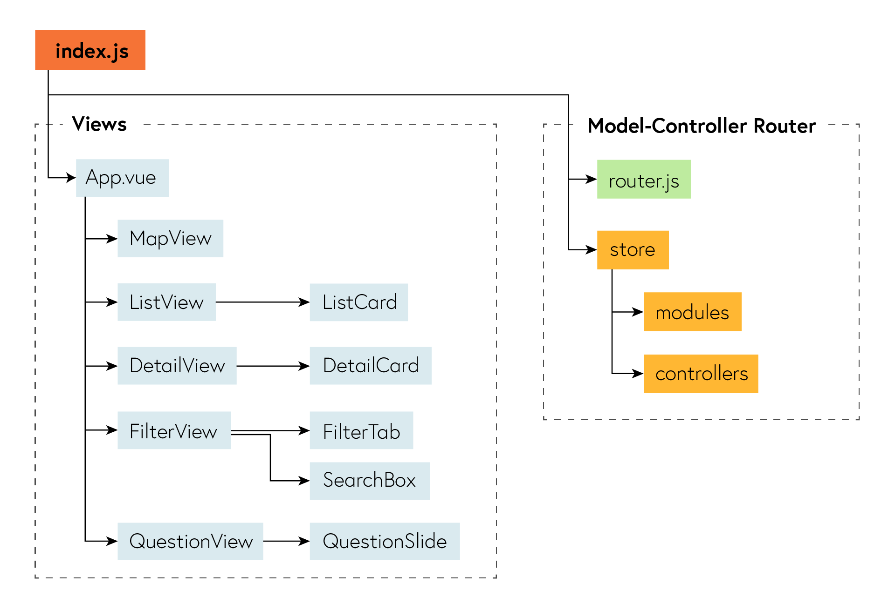
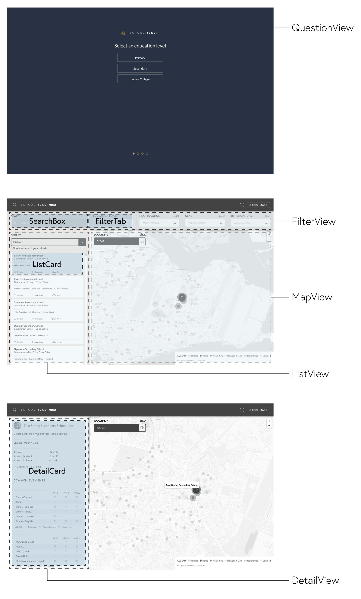
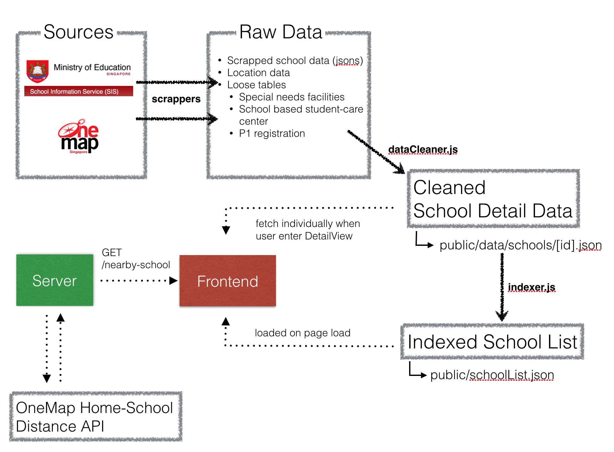

# datagovsg-moe-school-picker
A data.gov.sg open-source project

## Introduction
SchoolPicker.sg app is a project to showcase the possibility of open data. It is a tool for parents and students to find an ideal school. By entering home address, they are able to see what are the schools in their vicinity and filter them based on the programmes they offered, CCAs etc. Our underlying data are all obtained from publicly available sources: anyone who knows a bit of web programming can do the same as we did and create something that benefits the public.

We believe the data exploration tool we built can be extended to many other use case (think [CHAS](https://www.chas.sg/) clinics or [ECDA](https://www.ecda.gov.sg/pages/default.aspx) child care centers) hence decided to open-source our code for anyone interested to learn how something like this could be build or even make improvements.

The app is built using the [Vue framework](https://vuejs.org/) and runs a [Node](https://nodejs.org/en/) backend. The reason for our choice of Vue as our frontend framework is so our app is built entirely on reusable and customizable components. As said earlier, there's many other use cases out there we have yet to explore so a component-based design will allow easy adaptation.

In this README, we will go through all stuff you need to understand how the app works underneath and how you can add your own customization or adapt the app for a different dataset and different use case. For a start, we encourage you to familiarize yourself with [Vue](https://vuejs.org/v2/guide/), its state management provider [Vuex](https://vuex.vuejs.org/en/intro.html), and its routing provider [vue-router](https://router.vuejs.org/en/).


## Setup

##### Install
`npm install`

##### Develop
`npm run dev`

##### Run production
`export NODE_ENV=production && npm run build && npm run start`

##### Data Processing
Additional setup required if you want to do your own data processing
```bash
# navigate to "preprocess" folder to install additional dependencies
cd src/preprocess/
npm install

# return to project root
cd ../../

# run preprocess scripts
babel-node src/preprocess/dataCleaner.js
babel-node src/preprocess/indexer.js
```

If you do not need to recompile travel time estimation, dev-dependency `osrm` can be omitted from `src/preprocess/package.json` to avoid installation error. Otherwise, refer to [this](https://github.com/Project-OSRM/osrm-backend/wiki/Building-OSRM#os-x-enable_masonoff) or [this](https://github.com/Project-OSRM/osrm-backend/wiki/Building-on-Ubuntu) for debugging instruction.


## App Organization


## Components Layout



## Customizing
Vue recommends using [single file components](https://vuejs.org/v2/guide/single-file-components.html) for writing clean modularized code and this is the approach we have adopted. All our views are written as Single File Components having the HTML template, Javascript script & CSS styles describing how the component look and function all encapsulated in a single (.vue) file. Here we will elaborate how each of the component can be customized.


### Customizing ListCards
ListCard components (src/components/ListView/CardFor...vue) accept two props `info` and `bookmarked`. It will render an info card based on the information provided. User interacting with the card can bookmark a school by emitting a `bookmark` event. To show more details of the school, user will emit a `focus` event which will bring them to DetailView.

##### Props
- `info` - JSON object containing summarized school information
- `bookmarked` - Boolean value indicating whether the school has been bookmarked

##### Events
- `bookmark` - to toggle `bookmarked` state
- `focus` - to bring up school detail


### Customizing DetailCard
DetailCard component (src/components/DetailView/CardFor...vue) also accepts two props `info` and `bookmarked`. Difference between this and ListCard is that `info` provided here is more detailed then (eg. public/data/schools/0701.json) then the summarized version provided to ListCards (public/schoolList.json). User interacting with the card can bookmark a school by emitting a `bookmark` event. If user wants to exit from DetailView back to ListView, `close` event should be emitted.

##### Props
- `info` - JSON object containing detailed school information
- `bookmarked` - Boolean value indicating whether the school has been bookmarked

##### Events
- `bookmark` - to toggle `bookmarked` state
- `close` - to exit DetailView


### Customizing FilterView
You can customize your FilterView (src/components/FilterView/TabsFor.../index.vue) by composing it with a different set of FilterTabs. Just import in your components and

Example:
```html
<template>
  <div class="picker-filter">
    <div class="row auto">
      <MyFilterTabOne class="width-1of4" />
      <MyFilterTabTwo class="width-1of4" />
      <MyFilterTabThree class="width-1of4" />
      <MyFilterTabFour class="width-1of4" />
    </div>
  </div>
</template>

<script>
import MyFilterTabOne from './MyFilterTabOne.vue'
import MyFilterTabTwo from './MyFilterTabTwo.vue'
import MyFilterTabThree from './MyFilterTabThree.vue'
import MyFilterTabFour from './MyFilterTabFour.vue'

export default {
  components: {
    MyFilterTabOne,
    MyFilterTabTwo,
    MyFilterTabThree,
    MyFilterTabFour
  }
}
</script>
```


### Customizing FilterTabs
FilterTabs (src/components/FilterView/TabsFor.../...vue) are controls for user to set filters on the set of schools rendered on the map. To set up a FilterTab, you first need to create a new store module to specify the selectable options. For this example, we assume the FilterTab is a simple multi-select control.

```javascript
// in src/store/modulesFor...js
export const area = { // "area" is the name of the module
  state: {
    options: [{
      label: 'CENTRAL',
      areas: [
        {label: 'Bishan', value: 'BS'},
        {label: 'Toa Payoh', value: 'TP'}
      ]
    }, {
      label: 'NORTH-EAST',
      areas: [
        {label: 'Ang Mo Kio', value: 'AM'},
        {label: 'Serangoon', value: 'SG'}
      ]
    }, {
      label: 'WEST',
      areas: [
        {label: 'Bukit Batok', value: 'BK'},
        {label: 'Jurong West', value: 'JW'}
      ]
    }, {
      label: 'EAST',
      areas: [
        {label: 'Tampines', value: 'TM'}
      ]
    }, {
      label: 'NORTH',
      areas: [
        {label: 'Yishun', value: 'YS'}
      ]
    }], // options object can be nested, as long as branch tip contains a 'value' key
    selected: [] // default selected values
  }
}
```

In your FilterTab component, use `mapState` to fetch `options` and `selected` from your module state and use it to populate your filter controls.

```html
<!-- in src/components/FilterView/TabsFor.../MyFilterTab.vue -->
<template>
  <div class="area-tab">
    <div v-for="group in options">
      <label>{{group.label}}
        <select  multiple>
          <option v-for="area in group.areas" :value="area.value">{{area.label}}</option>
        </select>
      </label>
    </div>
  </div>
</template>

<script>
import {mapState} from 'vuex'

export default {
  computed: {
    ...mapState({
      options: state => state.areas.options,
      selected: state => state.areas.selected // module state is namespaced
    })
  }
}
</script>
```

Store provides actions `selectOptions`, `unselectOptions` & `resetOptions` to manipulate your selected state

```javascript
console.log(store.state.areas.selected) // []

store.dispatch('selectOptions', {
  module: 'areas',
  options: {label: 'Bishan', value: 'BS'} // a single branch tip
})

console.log(store.state.areas.selected) // ['BS']
```

The `selectOptions` & `unselectOptions` actions take in an object argument with the following keys:

- `module` - name of the module that holds your filter option state
- `options` - provides a branch of the `options` object to individually or bulk select/unselect options

For `resetOptions`, only `module` need to be provided.

```javascript
store.dispatch('selectOptions', {
  module: 'areas',
  options: {
    label: 'NORTH-EAST',
    areas: [
      {label: 'Ang Mo Kio', value: 'AM'},
      {label: 'Serangoon', value: 'SG'}
    ]
  } // an entire sub-branch
})

console.log(store.state.areas.selected) // ['BS', 'AM', 'SG']

store.dispatch('unselectOptions', {
  module: 'areas',
  options: {
    label: 'NORTH-EAST',
    areas: [
      {label: 'Ang Mo Kio', value: 'AM'},
      {label: 'Serangoon', value: 'SG'}
    ]
  }
})

console.log(store.state.areas.selected) // ['BS']

store.dispatch('resetOptions', {
  module: 'areas'
})

console.log(store.state.areas.selected) // []
```

Store also provides a `optionsSelected` getter to check if all the values belonging to a branch are included in the selected list.

```javascript
store.dispatch('selectOptions', {
  module: 'areas',
  options: {
    label: 'NORTH-EAST',
    areas: [
      {label: 'Ang Mo Kio', value: 'AM'},
      {label: 'Serangoon', value: 'SG'}
    ]
  }
})

console.log(store.state.areas.selected) // ['AM', 'SG']

store.getters.optionsSelected({
  module: area,
  options: {label: 'Ang Mo Kio', value: 'AM'} // a single branch tip
}) // returns true

store.getters.optionsSelected({
  module: area,
  options: {
    label: 'NORTH-EAST',
    areas: [
      {label: 'Ang Mo Kio', value: 'AM'},
      {label: 'Serangoon', value: 'SG'}
    ]
  } // an entire sub-branch
}) // returns true

store.getters.optionsSelected({
  module: area,
  options: {label: 'Yishun', value: 'YS'}
}) // returns false
```

Putting everything together

```html
<template>
  <div class="area-tab">
    <div v-for="group in options">
      <p>{{group.label}}</p>
      <label>
        <input type="checkbox" :checked="checked(group)" @input="select(group, $event)"/>
        Select all
      </label>
      <label v-for="area in group.areas">
        <input type="checkbox" :checked="checked(area)" @input="select(area, $event)"/>
        {{area.label}}
      </label>
    </div>
  </div>
</template>

<script>
import {mapState, mapGetters, mapActions} from 'vuex'

export default {
  computed: {
    ...mapState({
      options: state => state.areas.options,
      selected: state => state.areas.selected // module state is namespaced
    }),
    ...mapGetters(['optionsSelected'])
  },
  method: {
    ...mapActions(['selectOptions', 'unselectOptions', 'exportOptions']),
    checked (options) {
      return this.optionsSelected({module: 'areas', options})
    },
    select (options, toCheck) {
      if (toCheck) this.selectOptions({module: 'areas', options})
      else this.unselectOptions({module: 'areas', options})
      this.exportOptions().then(query => this.$router.push({query}))
    }
  }
}
</script>
```

### Customizing MapView
In the last section, we showed how to set up a simple FilterTab to select / unselect option values. The filtered option values will translate into which points are rendered on the map and which are excluded.

You write your own `getFiltered` function in the controller (src/store/controllerFor...js) and map it to the `filtered` getter in your store.

```javascript
// in src/store/controllerFor...js
export function myCustomGetFiltered (state, getters) {
  return state.schoolList.filter(school => {
    if (state.areas.selected.length > 0) {
      return state.areas.selected.indexOf(school.planningArea) > -1
    }
    return true
  })
}

// in src/store/index.js
import {myCustomGetFiltered} from './controllerFor...js'

const store = new Vuex.Store({
  getters: {
    filtered: myCustomGetFiltered
  }
})
```

The `filtered` getter can be used in your MapView component (src/components/MapView/index.vue). Any changed to filter options will propagate to the `filtered` store getter

```html
<script>
import {mapGetters} from 'vuex'

export default {
  computed: {
    ...mapGetters(['filtered'])
  },
  watch: {
    filtered (newFilteredList) {
      // updated map client (Google Maps, Leaflet) with new filtered list
    }
  }
}
</script>
```

### Customizing QuestionView
QuestionView (src/components/QuestionView/SlidesFor.../index.vue) contains a slide show of questions that help users pre-fill their filter options. If not needed, simply changed the fallback route in router (src/router.js) to redirect to `/explore`.

Similar to FilterView, you can compose your own question set by writing your own QuestionSlide components。

### Customizing QuestionSlides
Customizing QuestionSlides (src/components/QuestionView/SlidesFor.../...vue) follows the same steps as [FilterTabs](#Customizing-FilterTabs).

## Data Flow


School data are populated in two stage. On page load, `public/schoolList.json` is loaded first. This provides a list of schools with their summarized information, the minimum data required for filtering to work. Only when user taps into school detail then we fetch the detail jsons (public/data/schools/...json) individually. This allows a faster page load.

With regards to data processing, the process works in reverse. Scrappers will populate the raw data which will then be cleaned and processed `src/preprocess/dataCleaner.js` into the school detail jsons. We then pass the processed school details through an indexer `src/preprocess.indexer.js` to generate the summarized school information list that is loaded on page load.

## If you need help
- Refer to this [README](#)
- If you are not familiar with Vue, go through the [Vue](https://vuejs.org/v2/guide/), [Vuex](https://vuex.vuejs.org/en/intro.html), and [vue-router](https://router.vuejs.org/en/), again
- If you find a bug, raise an issue in this GitHub repo
- If you know a fix, send me a PR
- Still clueless? Contact me @ [yongjun@data.gov.sg](mailto:yongjun@data.gov.sg)
